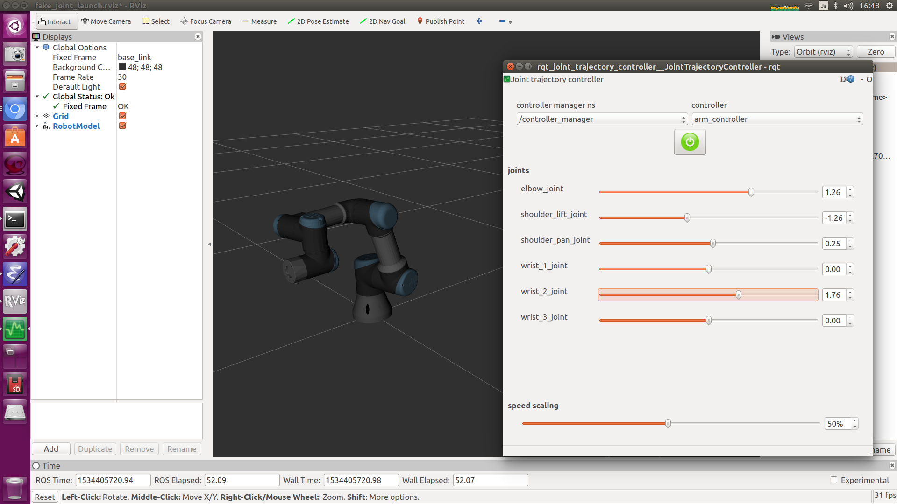
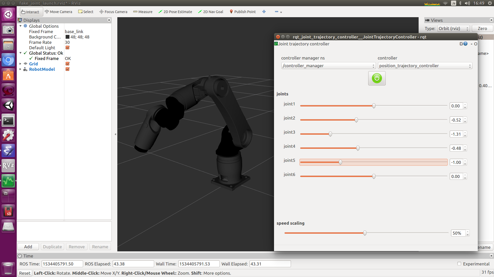
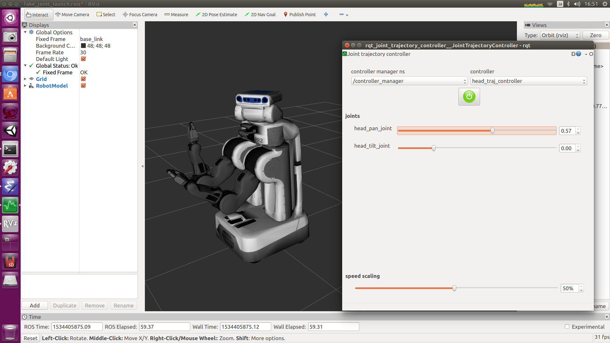

# fake_joint [](https://travis-ci.org/tork-a/fake_joint)

## What is this?

This repositry contains the packages for simulating 'fake' (i.e. dummy
or loop-back) joint driver for the
[ros_control](https://github.com/ros-controls/ros_control) framework.

## Why we need this?

You may know MoveIt! has own controller manager and
`moveit_fake_controller` to simulate the robot motion. However, the
interface and code are different from `ros_control` framework. We have
experienced our [jog_control](https://github.com/tork-a/jog_control)
package doesn't work with moveit_fake_controller while it works fine
with ros_control. One solution is to make 'fake' joint driver for
ros_control and not to use moveit_fake_controller.

You can simulate the joint controller using gazebo plugin. However,
sometimes it is overkill for the purpose. Gazebo is rather CPU
consuming for powerless PC or CI environments. And not all of the
robot support gazebo model.

When some problems occured, say in MoveIt!, it could be difficult to
know whether the problem is from MoveIt! setting or joint controller
parameters. `fake_joint` guarantees the controller works perfectly,
means it simulates the precice motion as commended. This package
eliminates the possibility of controller side in your debugging.

## Quick start

'fake_joint_launch' contains some launch and config files for several
robots. You can easily try this package. They simulate real robot
interface like joint trajectory action, so you can use MoveIt! on it.

### UR3/UR5



```
$ roslaunch fake_joint_launch ur3.launch use_rqt:=true
```

### TRA1



```
$ roslaunch fake_joint_launch tra1.launch use_rqt:=true
```

### PR2



```
$ roslaunch fake_joint_launch pr2.launch use_rqt:=true
```
